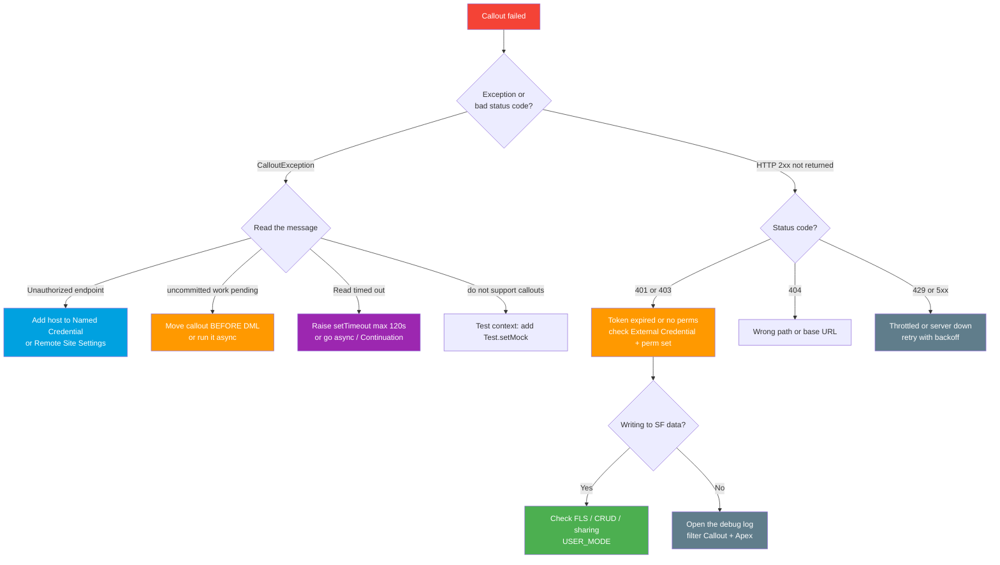

# Callout Debug Checklist One-Pager (Spring '26, v66.0)

> "My callout failed — now what?" Work top to bottom. Limits + testing in **[../05-Outbound-Callouts/07-callout-limits-and-testing.md](../05-Outbound-Callouts/07-callout-limits-and-testing.md)**; security layers in **[../09-Security-Limits/README.md](../09-Security-Limits/README.md)**.

---

## Decision flowchart

---

## Checklist (in order)

| # | Check | Symptom / error | Fix |
|---|---|---|---|
| 1 | **Status code** | 401/403 vs 404 vs 429/5xx tells you the layer | Triage by class: 4xx = your request, 5xx = their server |
| 2 | **Host allowlisted** | `Unauthorized endpoint, please check Setup->Security->Remote site settings` | Prefer **Named Credential**; else add the host to **Remote Site Settings** |
| 3 | **Uncommitted DML** | `You have uncommitted work pending. Please commit or rollback before calling out` | Call out **before** any DML, or move it **async** (Queueable/@future) |
| 4 | **Timeout** | `Read timed out` / `CalloutException` after a hang | `req.setTimeout(ms)` (max **120000**); slow UI → **Continuation** |
| 5 | **Auth / token** | 401, `INVALID_SESSION_ID`, expired token | Check **External Credential** principal + **perm-set mapping**; token may need refresh/rotate |
| 6 | **IP / CORS** | Inbound browser blocked, or LWC fetch blocked | Inbound browser → **CORS allowlist**; LWC outbound → **CSP Trusted Site** |
| 7 | **FLS / object perms** | Callout OK but the **DML** after it fails | Enforce + verify CRUD/FLS/sharing (`WITH USER_MODE`, `stripInaccessible`) |
| 8 | **Governor limits** | `Too many callouts: 100`, or heap/size error | Bulkify (100/txn cap); payload **6 MB sync / 12 MB async**; total callout time **120 s/txn** |
| 9 | **Concurrent long-running** | New sync callouts rejected under load | Sync calls **>5 s** count vs org pool (**10**, scales by license) → go async/Continuation |
| 10 | **Test context** | `Methods defined as TestMethod do not support Web service callouts` | Real calls blocked in tests → `Test.setMock(HttpCalloutMock.class, ...)` |
| 11 | **Debug log** | Nothing obvious above | Setup → **Debug Logs**; set a trace flag, raise **Callout** + **Apex Code** to FINEST, re-run, read request/response |

---

## Fast reminders

- **4xx** = don't blindly retry (fix the request / auth). **5xx + timeouts** = bounded retry with **backoff** + **idempotency key**.
- **`callout:Named_Credential/path`** skips Remote Site Settings entirely and injects auth — the secret-free default.
- **Async ≠ free pass**: still subject to limits, just a higher payload ceiling and outside the concurrent-sync pool.
- **Never log secrets** when persisting request/response for traceability.

---

*Source: [Callout Limits and Limitations — Apex Developer Guide (v66.0)](https://developer.salesforce.com/docs/atlas.en-us.apexcode.meta/apexcode/apex_callouts_timeouts.htm) · [Execution Governors and Limits](https://developer.salesforce.com/docs/atlas.en-us.apexcode.meta/apexcode/apex_gov_limits.htm). Verified June 2026. Full modules: [../05-Outbound-Callouts/07-callout-limits-and-testing.md](../05-Outbound-Callouts/07-callout-limits-and-testing.md) · [../09-Security-Limits/README.md](../09-Security-Limits/README.md).*
