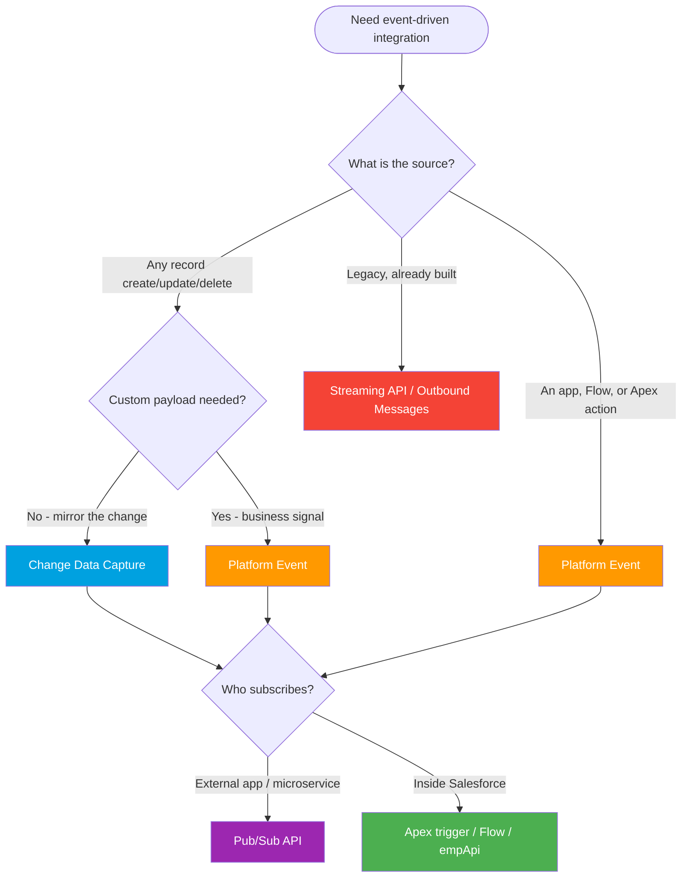

# Event Mechanisms One-Pager (Spring '26)

> Platform Events vs CDC vs Outbound Messages vs Streaming API vs Pub/Sub API. Full detail in **[../06-Event-Driven/README.md](../06-Event-Driven/README.md)**.

---

## The comparison table

| Mechanism | Who creates the event | Schema | Transport | Retention | Subscribers | Status |
|---|---|---|---|---|---|---|
| **Platform Events** | You (deliberate business signal) | Custom fields you define (`__e`) | Event bus (Pub/Sub, empApi, CometD) | **72h** (high-volume) | Apex, Flow, empApi, Pub/Sub API | **Modern** |
| **Change Data Capture** | Salesforce (auto on record change) | Fixed: `ChangeEventHeader` + changed fields | Event bus (Pub/Sub, empApi, CometD) | **72h** | Apex, Flow, empApi, Pub/Sub API | **Modern** |
| **Outbound Messages** | Workflow Rule / Flow (declarative) | Configured field set | SOAP XML to one endpoint | Auto-retry up to **24h** (7 days via Support) | One SOAP endpoint | **Legacy** |
| **Streaming API** | PushTopic (SOQL) / generic channel | JSON (PushTopic row or custom payload) | CometD long-polling (Bayeux) | **24h** (PushTopic) | CometD clients | **Legacy** |
| **Pub/Sub API** | n/a (transport for PE + CDC) | Avro per topic | gRPC over HTTP/2 | **72h** (carries PE / CDC) | External apps, microservices | **Modern** |

---

## Pick a mechanism

---

## Platform Events vs CDC (the classic question)

| Question | Platform Events | CDC |
|---|---|---|
| Who creates the event? | **You** (a deliberate signal) | Salesforce (automatic) |
| Schema | You define the fields | Fixed: `ChangeEventHeader` + changed fields |
| Customizable payload? | Yes | No |
| Best for | Business events (`OrderShipped`) | Replicating record changes to a store |

---

## Must-knows

- **Retention is 72 hours** for high-volume Platform Events and CDC. The "96 hours" figure is a **myth**. Legacy standard-volume events were 24h and are **retired**.
- **PushTopic / Streaming API events retain for 24h**, shorter than the 72h event-bus window.
- **Replay IDs**: store the last one and resubscribe within the window. `-1` = new only, `-2` = all retained, or a specific ID to resume.
- **Delivery is at-least-once**, not exactly-once. Subscribers must be **idempotent**.
- **Transport, not source**: the **Pub/Sub API** (gRPC + Avro) is the modern subscriber for both Platform Events and CDC. The CometD **Streaming API** is legacy for new builds.
- **Outbound Messages** still work but Workflow Rules / Process Builder get no enhancements. Build new declarative push in **Flow**, or prefer Platform Events.

*Source: [Pub/Sub API — Event Message Durability](https://developer.salesforce.com/docs/platform/pub-sub-api/guide/event-message-durability.html) and [Platform Events Developer Guide](https://developer.salesforce.com/docs/atlas.en-us.platform_events.meta/platform_events/platform_events_intro.htm). Full module: [../06-Event-Driven/README.md](../06-Event-Driven/README.md). Verified June 2026.*
