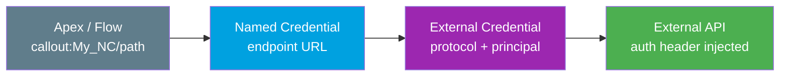

# Named Credentials Syntax One-Pager (Spring '26, v66.0)

> Copy-paste outbound auth reference. **Never hardcode secrets** — reference `callout:Name`. Full detail in **[../03-Authentication/14-named-credentials-and-external-credentials.md](../03-Authentication/14-named-credentials-and-external-credentials.md)**.

---

## The model in one line

**Named Credential** = *where* (endpoint URL). **External Credential** = *how* (auth protocol + principals + permission-set mappings). Split since **Winter '23**; one External Credential backs many Named Credentials.



---

## Apex callout — the whole point

```apex
HttpRequest req = new HttpRequest();
req.setEndpoint('callout:My_Named_Cred/v1/orders'); // 'callout:' + NC name + path
req.setMethod('GET');
HttpResponse res = new Http().send(req);
System.debug(res.getStatusCode() + ' ' + res.getBody());
```

Salesforce swaps `callout:My_Named_Cred` for the real URL **and** injects the auth header at send time. Your code, repo, logs, and packages stay secret-free. Rotating a credential is a config change — zero deploys.

**POST with a merge field** (only if *Allow Formulas in HTTP Body* is enabled on the NC):

```apex
HttpRequest req = new HttpRequest();
req.setEndpoint('callout:My_Named_Cred/v1/tickets');
req.setMethod('POST');
req.setHeader('Content-Type', 'application/json');
req.setBody('{"agent":"{!$Credential.My_External_Cred.Username}"}');
HttpResponse res = new Http().send(req);
```

**Custom header / API key merge field** (define on the NC, every callout carries it):

```apex
// Header value references a field stored in the External Credential at runtime
req.setHeader('X-API-Key', '{!$Credential.My_External_Cred.ApiKey}');
```

> Merge-field syntax: `{!$Credential.<ExternalCredential>.<field>}`. Standard fields: `.Username`, `.Password`. Custom auth params are referenced by their configured name.

---

## Named Principal vs Per-User

| Principal type | Identities | Use when | Example |
|---|---|---|---|
| **Named Principal** | **One shared** for all users | External system does not care *which* SF user | Nightly sync under one service account |
| **Per-User Principal** | **Each user** authenticates individually | External system needs the real end user | User connects their own DocuSign/Google |
| **Client Credentials** | The **app's own** client identity | OAuth Client Credentials, no user context | Backend service under app client id/secret |

> **Per-User**: each user must self-authenticate via **Authenticate** in their personal settings. Multiple mappings on one user → lowest **sequence number** wins.

---

## Permission-set mapping is REQUIRED

A principal is **inert** until mapped to a **permission set** (or PS group / profile) and that set assigned to the running user. No mapping = auth failure, even for an admin.

```
External Credential -> Principal -> mapped to Permission Set -> assigned to User
```

---

## Auth protocols (External Credential)

| Protocol | Authenticates with | Typical use |
|---|---|---|
| **OAuth 2.0 — Browser Flow** | User logs in via browser callback | Per-user SaaS needing consent |
| **OAuth 2.0 — JWT / JWT Bearer** | Signed JWT (org cert) → token | Server-to-server, no browser |
| **OAuth 2.0 — Client Credentials** | Client id + secret → token | Backend, one system identity |
| **Basic** | Static username + password | Legacy Basic-auth APIs |
| **AWS Signature v4** | AWS key + secret sign each request | S3, API Gateway (also STS Roles Anywhere via cert) |
| **API Key** | Secret in a **Custom** header | APIs using a static key |
| **Custom** | Your own headers / params | Anything non-standard |
| **mTLS** | Client + server certificates | High-security APIs requiring client certs |

> **Gotcha**: *API Key* is not its own dropdown — implement it as a **Custom** external credential with a **custom header** carrying the key.

---

## Setup order (do auth first)

1. **Setup → Named Credentials → External Credentials → New** → pick protocol.
2. Add a **Principal** (Named, Per-User, or Client Credentials) + enter secrets.
3. **Map the principal to a permission set** *(mandatory)*.
4. **Named Credentials → New** → set **URL** + select the External Credential.
5. Callout options: **Generate Authorization Header** (usually on); **Allow Formulas in HTTP Header/Body** only if you need merge fields.
6. **Assign the permission set** to users who run the callout.

---

*Source: [Authentication Protocols for Named Credentials — Salesforce Help](https://help.salesforce.com/s/articleView?id=xcloud.nc_auth_protocols.htm&type=5) · [Named Credentials as Callout Endpoints — Apex Developer Guide](https://developer.salesforce.com/docs/atlas.en-us.apexcode.meta/apexcode/apex_callouts_named_credentials.htm). Verified June 2026. Full module: [../03-Authentication/14-named-credentials-and-external-credentials.md](../03-Authentication/14-named-credentials-and-external-credentials.md).*
