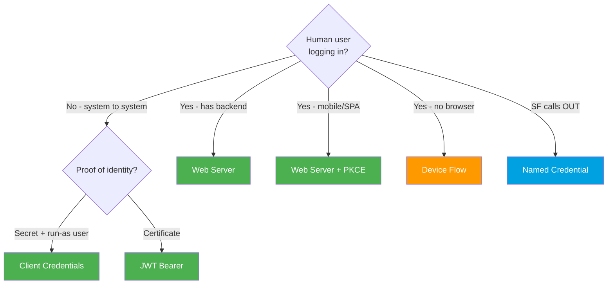

# OAuth Flows One-Pager (Spring '26)

> Fast pre-interview cram sheet. Full detail in **[../03-Authentication/](../03-Authentication/README.md)**.

---

## Pick a flow in 10 seconds

---

## All flows at a glance

| Flow | `grant_type` | User? | Refresh? | Use when |
|---|---|:--:|:--:|---|
| Web Server | `authorization_code` | ✅ | ✅ | Web app, user login (default) |
| Web Server + PKCE | `authorization_code` + `code_challenge` | ✅ | ✅ | Mobile / SPA / public client |
| JWT Bearer | `urn:ietf:params:oauth:grant-type:jwt-bearer` | ❌ | ❌ | Server-to-server, certificate, CI/CD |
| Client Credentials | `client_credentials` | ❌ | ❌ | **Modern** server-to-server, secret |
| Device | `device` (after `response_type=device_code`) | ✅ | ✅ | TV, CLI, IoT |
| Refresh Token | `refresh_token` | ❌ | reuses | Renew an expired access token |
| SAML Bearer | `urn:ietf:params:oauth:grant-type:saml2-bearer` | ❌ | ❌ | Server-to-server, existing SAML |
| SAML Assertion | `assertion` (SSO browser) | ✅ | ❌ | API access after web SSO |
| Asset Token | `urn:ietf:params:oauth:grant-type:token-exchange` | ❌ | n/a | IoT device/asset binding |
| Auth Code & Credentials | `authorization_code` (headless) | ✅ | ✅ | Headless / branded customer login |
| ⛔ Username-Password | `password` | ✅ | ❌ | **Retiring — do not use** |
| ⚠️ User-Agent | `response_type=token` | ✅ | opt | **Legacy — avoid** |

---

## Tokens

| Token | What | Sent as | Refresh-returning flows |
|---|---|---|---|
| **Access** | API key (= session id), ~2h | `Authorization: Bearer ...` | all |
| **Refresh** | Renew access silently | `POST /token grant_type=refresh_token` | Web Server, Device, Auth Code & Creds |
| **ID token** | OIDC JWT describing the user | returned when `openid` requested | flows with `openid` scope |

**Common scopes**: `api` (data APIs) · `refresh_token`/`offline_access` (refresh) · `openid` (ID token) · `web` (`frontdoor.jsp`) · `full` (everything, but still add `refresh_token`).

---

## Endpoints (under your My Domain `/services/oauth2/`)

`/authorize` (browser login) · `/token` (app exchange) · `/revoke` (logout/kill) · `/introspect` (is it valid?) · `/userinfo` (OIDC profile).

---

## Outbound (Salesforce → external)

Always a **Named Credential + External Credential**. Apex: `req.setEndpoint('callout:My_Named_Credential/path')`. No hardcoded secrets. Principal = **Named** (one shared identity) or **Per-User**.

---

## 2025-26 must-knows

- **Username-Password retiring** (Winter '27; blocked by default for orgs created Summer '23+).
- **External Client Apps** replace Connected Apps (new Connected App creation disabled by default in **Spring '26**).
- **Client Credentials** = server-to-server default. **PKCE** = recommended for all interactive flows.
- **Device Flow** removed from Data Loader's auto-installed app (**Sept 2, 2025**).

---

## 30-second talking points

- *AuthN vs AuthZ*: identity vs permission. OAuth = authorization; OpenID Connect = the authentication layer (ID token).
- *Why code-then-token?*: keeps the access token off the browser/URL.
- *Machine flows have no refresh token*: no user session to keep alive, just re-run.
- *Never hardcode credentials*: Named Credentials centralize and rotate them.

*Source: [Salesforce Help — OAuth Authorization Flows](https://help.salesforce.com/s/articleView?id=sf.remoteaccess_oauth_flows.htm&type=5). Verified June 2026.*
