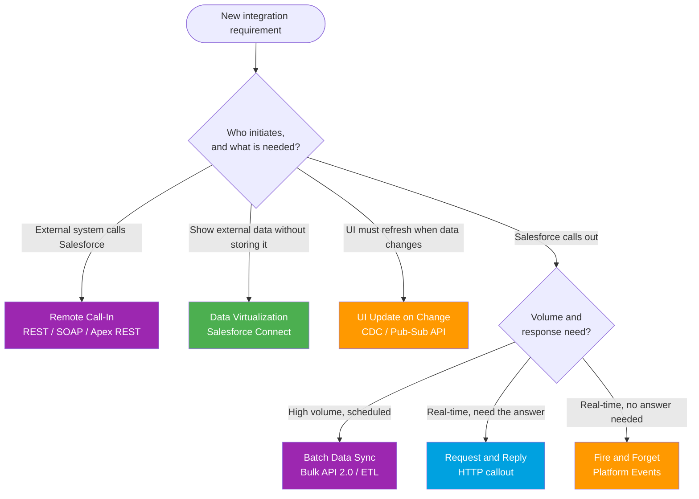

# Integration Patterns One-Pager (Spring '26)

> The **6 official Salesforce integration patterns** at a glance. Full detail in **[../02-Integration-Patterns/README.md](../02-Integration-Patterns/README.md)**.

---

## The 6 patterns (memorize this)

| Pattern | Direction | Timing | Volume | Salesforce tech | Use when |
|---|---|---|---|---|---|
| **Request & Reply** | SF → External | Sync | Low | HTTP callout, External Services | You need the answer **now** to continue. |
| **Fire & Forget** | SF → External | Async | Low-Med | Platform Events, Outbound Messages | You announce an event and **don't wait**. |
| **Batch Data Sync** | Both ways | Scheduled / async | High | Bulk API 2.0, ETL / MuleSoft | **Large** volumes on a schedule. |
| **Remote Call-In** | External → SF | Sync or async | Any | REST / SOAP API, Apex REST | An **external system** drives the CRUD. |
| **Data Virtualization** | SF reads External | Real-time read | Low-Med | Salesforce Connect (OData) | **View** external data without copying it. |
| **UI Update on Change** | SF → subscribers | Async push | Med | CDC, Pub/Sub API, empApi | UI must **auto-refresh** on a change. |

---

## Pick a pattern in 10 seconds

---

## Scenario → pattern (rapid mapping)

| Requirement | Pattern |
|---|---|
| "Check a credit score before saving the loan." | **Request & Reply** |
| "Tell the ERP an order shipped." | **Fire & Forget** |
| "Sync 2M accounts from SAP every night." | **Batch Data Sync** |
| "Our website must create Leads in Salesforce." | **Remote Call-In** |
| "Show SAP invoices on the Account, don't store them." | **Data Virtualization** |
| "The agent console must update the moment a Case changes." | **UI Update on Change** |

---

## 30-second talking points

- **Request & Reply vs Fire & Forget**: Reply **waits** for and uses the response (sync). Forget sends and **moves on** (async). Choose by whether the result drives the next step.
- **Sync first decision**: if you can wait, async unlocks scale (Bulk, Platform Events). If a user is blocked, stay sync and keep payloads small.
- **Remote Call-In** is the only pattern where the **external system** is the client. Authenticate with a Connected App / External Client App + OAuth.
- **Data Virtualization** triggers a callout on **every view**, so it reads live but does not scale to heavy traffic. Use for low-to-medium read volume.
- **Never loop synchronous callouts** for bulk. That is a Batch Data Sync, not many Request & Reply calls.

*Source: [Integration Patterns and Practices (v66.0, Spring '26)](https://developer.salesforce.com/docs/atlas.en-us.integration_patterns_and_practices.meta/integration_patterns_and_practices/integ_pat_intro_overview.htm). Full module: [../02-Integration-Patterns/README.md](../02-Integration-Patterns/README.md). Verified June 2026.*
