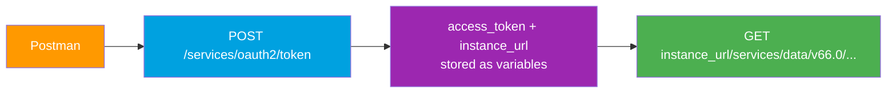

# Postman + Salesforce Setup One-Pager (Spring '26, v66.0)

> One-time setup to hit Salesforce REST APIs by hand. Full detail in **[../10-Tools-Middleware/01-postman.md](../10-Tools-Middleware/01-postman.md)**.

---

## What Postman does

Runs the OAuth dance, captures `access_token` + `instance_url` into environment variables, then sends `Authorization: Bearer {{access_token}}` against `{{instance_url}}`.



---

## Setup steps

1. **Install Postman** (desktop or web) and sign in.
2. **Fork the official "Salesforce Platform APIs" collection** from the Salesforce Developers workspace on Postman (right side → **Fork**). You get ready-made query/CRUD/composite/bulk requests with variables wired up.
3. **Create a Connected App or External Client App** in Setup (App Manager → New):
   - Enable OAuth Settings.
   - **Callback URL**: `https://oauth.pstmn.io/v1/callback`
   - **Scopes**: `api refresh_token` (add `refresh_token` so the token can renew).
   - Save → copy the **Consumer Key** and **Consumer Secret** (wait ~10 min for activation).
4. **Select an environment** and set variables:

   | Variable | Value |
   |---|---|
   | `login_url` | Your **My Domain** URL, e.g. `https://mydomain.my.salesforce.com` |
   | `client_id` | Consumer Key |
   | `client_secret` | Consumer Secret |
   | `username` | (per flow) integration username |

5. **Run an OAuth flow** on the collection's **Authorization** tab → **Configure New Token**:
   - **Logged-in user** → **Authorization Code** (browser consent via the `pstmn.io` callback).
   - **Server-to-server** → **Client Credentials** (no user; the app's run-as identity).
   - Click **Get New Access Token** → **Use Token**. Postman stores `access_token` (and usually `instance_url`).
6. **Send a query**:

```
GET {{instance_url}}/services/data/v66.0/query?q=SELECT+Id,Name+FROM+Account+LIMIT+5
Authorization: Bearer {{access_token}}
```

> Use `+` for spaces in the `q` param, or let Postman URL-encode the value.

---

## Troubleshooting

| Symptom | Fix |
|---|---|
| `401 INVALID_SESSION_ID` | Token expired → **Get New Access Token** again, or use refresh token. |
| `redirect_uri_mismatch` | Callback must be exactly `https://oauth.pstmn.io/v1/callback`. |
| Data call hits `login.salesforce.com` | Use **My Domain** / `{{instance_url}}`, never the login host, for data. |
| `invalid_client_id` / `invalid_client` | Wrong key/secret, or app not yet active (wait ~10 min). |
| Client Credentials returns no token | App needs a **run-as user** set under OAuth policies for that flow. |
| Username-Password flow fails | It's **blocked/retiring** — use Authorization Code or Client Credentials. |
| `Session expired` after some time | Re-auth; consider `refresh_token` scope for silent renew. |
| Forgot API version | Pin `v66.0` in the path. |

---

*Source: [Salesforce Platform APIs — Postman Collection](https://www.postman.com/salesforce-developers/salesforce-developers/collection/b32utmu/salesforce-platform-apis) · [Quick Start: Connected App for the REST API](https://developer.salesforce.com/docs/atlas.en-us.api_rest.meta/api_rest/quickstart.htm). Verified June 2026. Full module: [../10-Tools-Middleware/01-postman.md](../10-Tools-Middleware/01-postman.md).*
