# 01 - Retirements & Deprecations (the 2026-2028 timeline)

> **One-liner**: Salesforce is retiring legacy, password-based, and old-API integration paths and pushing everything to **OAuth + External Client Apps + current API versions**.
> **Why it matters**: These are the "what's changing on the platform?" questions interviewers love, and the migrations you'll actually be asked to do.

This is Module 13, awareness of what's new and what's going away. The replacements are all covered in Modules 03-09. Dates use Salesforce **release** names; a release rolls out over a few weeks around its season.

---

## 1. The idea in plain English

Salesforce retires things for two reasons: **security** (kill password-in-the-request and weak auth) and **modernization** (move everyone onto current APIs and External Client Apps). The pattern is always the same: a feature is **deprecated** (still works, no new investment), then **disabled by default** for new orgs, then **retired** (stops working). If you know the dates, you're never blindsided, and you sound current in an interview.

---

## 2. The timeline (memorize the big four)

```mermaid
flowchart LR
    A[Summer '25<br/>API v21-30 retired] --> B[Feb 16 2026<br/>Outbound Msg session Ids blocked]
    B --> C[Spring '26<br/>New Connected App creation off]
    C --> D[Summer '26<br/>Salesforce-to-Salesforce ends]
    D --> E[Winter '27<br/>Username-Password flow retired]
    E --> F[Summer '27 - Jun 1<br/>SOAP login retired]
    F --> G[Dec 2027<br/>Salesforce for Outlook retired]
    G --> H[Summer '28<br/>API v31-40 retired]

    style C fill:#ff9900,color:#fff
    style E fill:#F44336,color:#fff
    style F fill:#F44336,color:#fff
    style H fill:#9C27B0,color:#fff
```

| When | What retires / changes | What to do instead |
|---|---|---|
| **Done (Summer '25)** | API versions **21.0-30.0** retired | Move to **v41.0+** (ideally current v66/67). |
| **Feb 16, 2026** | **Outbound Messages** can no longer send a **Session ID** | Authenticate the callback with **OAuth**. |
| **Spring '26** | New **Connected App** creation **disabled by default** | Build new apps as **[External Client Apps](../03-Authentication/13-connected-apps-vs-external-client-apps.md)**. |
| **Summer '26 (v67.0)** | **Salesforce-to-Salesforce** discontinued; **"Use Any API Auth"** perm added; **API v31.0-40.0 deprecated** | Migrate S2S to Data Cloud One / MuleSoft / Partner tools. |
| **Winter '27** | **OAuth Username-Password flow** retired | **[Client Credentials](../03-Authentication/05-client-credentials-flow.md)** (server) or **Web Server + PKCE** (user). |
| **Summer '27 (Jun 1, 2027)** | **SOAP API `login()`** retired (v31.0-64.0; already gone in v65.0+) | OAuth via ECA. SOAP now accepts **JWT** access tokens. |
| **Dec 2027** | **Salesforce for Outlook** retired | Outlook Integration + Einstein Activity Capture. |
| **Summer '28** | API versions **31.0-40.0** retired | Move to **v41.0+**. |

---

## 3. The big four, explained

**1. New Connected Apps are off by default (Spring '26).** Creation is blocked in the UI and Metadata API (except package installs); re-enabling needs a Salesforce Support request. Build new integrations as **External Client Apps**, which separate developer config from admin policy and support only modern OAuth flows. See [Module 03](../03-Authentication/13-connected-apps-vs-external-client-apps.md).

**2. Username-Password OAuth flow retires (Winter '27).** Already blocked by default for orgs created Summer '23+. It passes raw credentials and bypasses MFA. Move servers to **Client Credentials**, users to **Web Server + PKCE**. See [Module 03](../03-Authentication/07-username-password-flow.md).

**3. SOAP `login()` retires (Summer '27, June 1 2027).** The most common legacy auth call. Gone from API **v65.0+** already; disabled by default in new orgs; from Summer '26 needs the **"Use Any API Auth"** permission. SOAP now accepts **JWT** OAuth tokens, so migrate auth to OAuth and keep your SOAP payloads if needed. See [Module 04](../04-Inbound-APIs/02-standard-soap-api.md).

**4. Old API versions retire (v31-40 in Summer '28).** Deprecated versions stop getting fixes, then fail. Audit integrations and bump to a current version (this vault targets **v66.0**).

---

## 4. How to find what affects your org

- Read each **Release Notes** "Retirement" section every season.
- Check **API Total Usage** and the per-version usage in **Setup → API Usage**, and the **`/services/data`** version list.
- Review **Connected Apps OAuth Usage** and **Login History** to spot legacy flows (Username-Password, SOAP login) still in use.
- Search Salesforce Help for the specific **"... Retirement"** knowledge article for an exact enforcement date.

---

## 5. Interview Q&A

**Q: What major integration retirements are coming?**
A: New Connected App creation is off by default (Spring '26), the Username-Password OAuth flow retires (Winter '27), SOAP `login()` retires (Summer '27), and API versions 31-40 retire (Summer '28). The throughline is OAuth + External Client Apps + current API versions.

**Q: A legacy job authenticates with SOAP `login()` and a password. How do you modernize it?**
A: Move auth to OAuth via an External Client App, using **JWT Bearer** or **Client Credentials**. SOAP API now accepts JWT access tokens, so the SOAP calls can stay while the auth modernizes.

**Q: Connected App or External Client App for a new build?**
A: External Client App. New Connected App creation is disabled by default as of Spring '26.

**Q: How do you know if a retirement affects you?**
A: Release notes retirement sections, API usage by version in Setup, and Login History / OAuth usage to find legacy auth still running.

**Talking point to explain it to anyone**: "Salesforce is turning off the old, password-based doors and moving everyone to modern keycards. The dates are published, so you migrate before the door locks."

---

## 6. Key terms

Deprecation, retirement, disabled-by-default, External Client App, JWT Bearer, Client Credentials - defined in [Module 03](../03-Authentication/01-authentication-fundamentals.md) and the [README](README.md).

---

## Sources (Verified June 2026)

- [Platform SOAP API login() Retirement — Salesforce Help](https://help.salesforce.com/s/articleView?id=005132110&type=1)
- [The Salesforce Developer's Guide to the Summer '26 Release](https://developer.salesforce.com/blogs/2026/06/the-salesforce-developers-guide-to-the-summer-26-release)
- [Spring '26 Release Architect Highlights](https://www.salesforce.com/blog/spring-26-release-architect-highlights/)
- [Retirement of OAuth 2.0 Username-Password Flow — Release Notes](https://help.salesforce.com/s/articleView?id=release-notes.rn_security_unpw_flow_retirement.htm&type=5)

---

*Next: [02-agentforce-mcp-and-integration.md](02-agentforce-mcp-and-integration.md) - how AI agents now call your integrations as Actions.*
