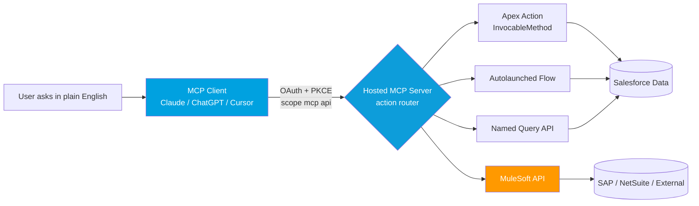

# 02 - Agentforce, MCP & Integration (the AI-agent shift)

> **One-liner**: AI agents can now call your integrations directly. An **MCP-compatible client** (Claude, ChatGPT, Cursor) connects to an org over **OAuth** and uses your **Flows, Apex actions, and Named Queries** as tools.
> **Why it matters**: This is the biggest 2026 shift for integration engineers. The integrations you build are no longer just for apps and ETL jobs, they become **actions an AI agent can discover and invoke**.
> **Status**: **Salesforce Hosted MCP Servers are GA** (announced Apr 29, 2026, headlined in Summer '26, API v67.0). Some adjacent pieces (Data 360 MCP server, Multi-Agent Orchestration) are still Preview/Beta. Flags below.

This is Module 13, awareness depth. For the underlying mechanics, see [Authentication](../03-Authentication/01-authentication-fundamentals.md) and [Modern APIs](../08-Modern-APIs/04-modern-api-landscape.md).

---

## 1. The idea in plain English

For years, an integration meant "system A calls system B over an API." In 2026 a third caller shows up: an **AI agent**. A user types a request in plain English, and an agent figures out which tool to call to satisfy it.

Two names you must know:

- **Agentforce** is Salesforce's platform for building and running **AI agents** (autonomous assistants that reason over a request and take actions). An agent reasons, then calls **Actions**, the discrete operations it is allowed to perform.
- **MCP (Model Context Protocol)** is an **open standard** for connecting AI clients to systems. Think of it as **USB-C for AI tools**: one plug shape so any compatible client can talk to any compatible server. Salesforce did not invent it, it adopted it.

The practical headline: **Salesforce now hosts MCP servers for you.** Enable a server in Setup and any MCP client can connect to your org over **OAuth**, with **your existing permissions** (CRUD, FLS, sharing) enforced automatically. No infrastructure to run.

---

## 2. What's new (the specifics)

A **hosted MCP server** is a Salesforce-managed endpoint that exposes your org's logic and data to any client that speaks MCP. You get two flavors: **standard** (prebuilt) and **custom** (you choose what to expose).

| Capability | What it is | Status (June 2026) |
|---|---|---|
| **Hosted MCP Servers** | Salesforce-managed MCP endpoints, OAuth + PKCE, permissions enforced per user | **GA** (Enterprise Edition and above) |
| **Standard servers** | Prebuilt: **SObject** (CRUD, SOQL, search), **Data 360** (queries, graph traversal), **Tableau** (analytics) | **GA** |
| **Custom servers** | You pick which tools and prompts to expose, full sharing model respected | **GA** |
| **`mcp_api` OAuth scope** | A dedicated scope for MCP, separate from the existing REST API scope | **GA** |
| **Prompt templates** | Prebuilt natural-language starting points (such as account review, deal analysis) | **GA** |
| **Agentforce as MCP tool** | Expose an Agentforce agent itself as an MCP tool | Rolling out |
| **Data 360 MCP Server** | Open-source server fronting roughly 200 Data 360 REST ops behind 3 facade tools | **Developer Preview** |
| **Marketing Cloud Engagement MCP** | Exposes data extensions and journeys as tools | **GA** (from July 2026) |

**The big shift: your integrations become agent tools.** A custom MCP server can build tools from any of these, with **no integration glue code**:

- **Apex Actions** - methods annotated `@InvocableMethod`.
- **Apex REST** - your existing custom `@RestResource` endpoints.
- **AuraEnabled Apex** - `@AuraEnabled` methods.
- **Lightning Flows** - autolaunched flows.
- **Named Query API** - parameterized SOQL exposed as a resource (see [04-platform-and-api-additions.md](04-platform-and-api-additions.md)).
- **Prompt Builder** prompts and the **API Catalog** (your curated REST registry).

So the Apex REST class you wrote in [Module 04](../04-Inbound-APIs/01-standard-rest-api.md), the Flow from a callout in [Module 05](../05-Outbound-Callouts/01-http-callouts.md), or a MuleSoft API can all become an **action an agent calls by name**.

---

## 3. How it works (architecture)

**Walkthrough**

1. The user asks for something in natural language inside their AI client.
2. The client connects to the org's hosted MCP server using **OAuth** (a dedicated `mcp_api` scope, plus **PKCE**). Every transaction runs **as the authenticated user**.
3. The server is the **action router**. It advertises only the tools you explicitly exposed, the agent cannot call an API that was not published.
4. The chosen tool runs: an Apex action, a Flow, a Named Query, or a MuleSoft-backed endpoint.
5. **Security is automatic.** CRUD, FLS, and sharing apply. If the user lacks permission, the agent cannot do it either. The user's name lands in the audit trail.

**Why "human at the wheel" matters**: MCP is itself a safety mechanism. **Structured tool calls replace open API access**, the server defines exactly what is callable, and the `mcp_api` scope does **not** grant the old REST APIs. Salesforce layers its permission model, audit trails, and a secure-by-default posture (servers must be explicitly enabled) on top.

---

## 4. What it means for integration work

The design rule changes. You are no longer building only for a known caller, you are building for an agent that **discovers** your tool and decides whether to call it. Design integrations to be **agent-consumable**.

| Old mindset (app-to-app) | New mindset (agent-consumable) |
|---|---|
| Endpoint named for an internal system | **Clear name + description** so an agent can pick it by intent |
| Inputs documented in a wiki | **Typed, self-describing inputs/outputs** (invocable variables, OpenAPI) |
| One service account, broad rights | **Runs as the user**, least-privilege, FLS and sharing do the gating |
| Auth via password or session ID | **OAuth + PKCE**, the `mcp_api` scope |
| Governance is "trust the caller" | **Governance is the design**: expose only what is safe, log everything |

**When you would reach for this**: a sales rep wants an account briefing without leaving Slack or Claude. A finance team reconciles closed-won opportunities against ERP entries from one chat. An ISV exposes industry-specific Apex actions so customer agents speak the data model in plain English. **When you would not**: high-volume system-to-system ETL still belongs on Bulk API 2.0 and Pub/Sub, MCP is for **agent-driven, conversational** access, not batch throughput.

**Getting started (under 30 minutes per Salesforce)**: enable a server in **Setup -> API Catalog -> MCP Servers**, create an **[External Client App](../03-Authentication/13-connected-apps-vs-external-client-apps.md)** with `mcp_api` and `refresh_token` scopes, then connect a client. Start with the read-only `sobject-reads` server in a sandbox.

---

## 5. Interview Q&A

**Q: What is MCP and why does Salesforce care?**
A: The **Model Context Protocol** is an open standard for connecting AI clients to systems, like USB-C for AI tools. Salesforce adopted it and now **hosts MCP servers** (GA, Summer '26), so any MCP-compatible client connects to an org over OAuth and uses Salesforce data and logic as tools, with permissions enforced.

**Q: How does an agent authenticate, and is it safe?**
A: **OAuth with PKCE**, using a dedicated `mcp_api` scope that does not unlock the regular REST APIs. Every transaction runs as the **authenticated user**, so CRUD, FLS, and sharing apply and the action is audited. The server only exposes tools you explicitly publish.

**Q: My team has an Apex REST class and a Flow. How do they become agent tools?**
A: Build a **custom hosted MCP server** and map them in. Custom servers can expose `@InvocableMethod` Apex actions, Apex REST, `@AuraEnabled` methods, autolaunched Flows, Named Queries, and Prompt Builder prompts, with no integration code.

**Q: How is this different from just calling the REST API?**
A: REST is open access to whatever the token allows. MCP gives the agent **structured, named tool calls** limited to what the server publishes, and a separate scope. It is safer and self-describing, the agent picks tools by intent rather than constructing arbitrary calls.

**Q: Should I move my nightly ETL to MCP?**
A: No. MCP suits **agent-driven, conversational** access. High-volume batch still belongs on **Bulk API 2.0** and **Pub/Sub API**. Use the right tool per workload.

**Talking point to explain it to anyone**: "We gave the org a universal AI plug. Any AI assistant can plug in, but it can only touch the doors we unlocked, only as the person using it, and every move is recorded."

---

## 6. Key terms

**Agentforce** (Salesforce's AI agent platform), **MCP** (open AI-to-system protocol), **hosted MCP server** (Salesforce-managed MCP endpoint), **Action** (a discrete operation an agent can call), **`mcp_api` scope** (OAuth scope for MCP), **standard vs custom server**. OAuth, PKCE, and External Client Apps are defined in [Module 03](../03-Authentication/01-authentication-fundamentals.md).

---

## Sources (Verified June 2026)

- [Salesforce Hosted MCP Servers Are Now Generally Available - Salesforce Developers Blog](https://developer.salesforce.com/blogs/2026/04/salesforce-hosted-mcp-servers-are-now-generally-available)
- [The Salesforce Developer's Guide to the Summer '26 Release](https://developer.salesforce.com/blogs/2026/06/the-salesforce-developers-guide-to-the-summer-26-release)
- [Agentforce MCP Support - Salesforce](https://www.salesforce.com/agentforce/mcp-support/)
- [MCP Solutions - Agentforce Developer Guide](https://developer.salesforce.com/docs/ai/agentforce/guide/mcp.html)
- [Hosted MCP Servers Developer Docs](https://developer.salesforce.com/docs/platform/hosted-mcp-servers)

---

*Next: [03-mulesoft-2026.md](03-mulesoft-2026.md) - MuleSoft as the governance and connectivity fabric for agents.*
