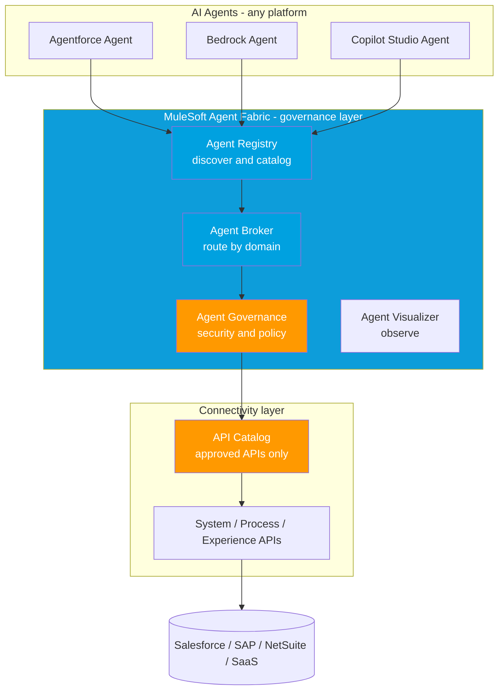

# 03 - MuleSoft in 2026 (the agent era)

> **One-liner**: MuleSoft is repositioning from "connect apps and APIs" to **"govern and connect AI agents."** Agent Fabric manages agent sprawl, Composer lets business users build integrations, and the API Catalog keeps agents on approved APIs.
> **Why it matters**: When agents start calling integrations (see [02-agentforce-mcp-and-integration.md](02-agentforce-mcp-and-integration.md)), someone has to govern which agents and APIs they can use. MuleSoft is making that its job.
> **Status**: **Agent Fabric components are GA** (Registry, Broker, Governance, Visualizer, since Oct 2025), Agent Scanners and AI Gateway LLM Governance GA in early 2026. **API Governance for Salesforce is Beta**. Flags below.

This is Module 13, awareness depth. For middleware and iPaaS fundamentals, see [../10-Tools-Middleware/06-middleware-and-ipaas.md](../10-Tools-Middleware/06-middleware-and-ipaas.md).

---

## 1. The idea in plain English

MuleSoft's classic value was **API-led connectivity**: build reusable APIs in three layers (**System** APIs to back-end systems, **Process** APIs for business logic, **Experience** APIs for each channel), then assemble apps from them instead of point-to-point spaghetti.

In 2026 that same idea is being pointed at **AI agents**. Enterprises are spinning up agents on every platform (Agentforce, Bedrock, Vertex, Copilot Studio), and the result is **agent sprawl**: redundant agents, no shared catalog, compliance blind spots. MuleSoft's pitch: it has governed APIs and applications for over a decade, so it is positioned to be the **governance and connectivity fabric for agents** too.

Think **air traffic control** for a fleet of agents: a single place to **register, route, govern, and observe** every agent, no matter who built it.

---

## 2. What's new (the specifics)

| Capability | What it does | Status (June 2026) |
|---|---|---|
| **MuleSoft Agent Fabric** | Discover, orchestrate, govern, observe any AI agent across clouds | GA (suite) |
| - **Agent Registry** | Central catalog where any agent or tool, including **MCP and A2A** servers, is registered and made discoverable | **GA** |
| - **Agent Broker** | Intelligent router that groups agents into business domains and routes tasks across them | **GA** |
| - **Agent Governance** | Enterprise guardrails: security, compliance, policy on every agent interaction | **GA** |
| - **Agent Visualizer** | Live map of the agent network, interactions, and dependencies | **GA** |
| - **Agent Scanners** | Auto-discover agents across Salesforce, Bedrock, Vertex AI, Copilot Studio | **GA** (early 2026) |
| **AI Gateway LLM Governance** | Central visibility of token usage, cost, and data flows for third-party models | **GA** |
| **MuleSoft Composer** | No-code "citizen integrator" tool inside Salesforce | **GA** |
| **API Catalog with MuleSoft Sync** | Governance and discovery layer so agents reach only **approved** APIs | Available |
| **API Governance for Salesforce** | Apply API governance rules and standards to Salesforce-built APIs | **Beta** |

**MuleSoft Composer** is the no-code piece. It is a **declarative, clicks-not-code** integration tool embedded in Salesforce, built for **business teams** (the "citizen integrator"). It ships prebuilt connectors for systems such as **Slack, Jira, NetSuite, Workday, and Google Sheets**, and turns manual multi-step processes into event-based automations. Typical flows: when a Salesforce opportunity closes, create the **NetSuite** sales order and post to **Slack**, or turn an urgent Service Cloud case into a **Jira** ticket plus a Slack alert. Business users build on **IT-built assets and templates**, so it complements, not replaces, full Anypoint development.

**API Catalog with MuleSoft Sync** is the discovery and governance layer. It is the curated registry agents and developers browse to find **approved** APIs, so an agent reaches a sanctioned, governed endpoint rather than an arbitrary one. **API Governance for Salesforce (Beta)** extends MuleSoft's governance rules onto Salesforce-built APIs so they meet the same standards.

---

## 3. How it works (Agent Fabric between agents and APIs)

**Walkthrough**

1. Agents from **any** platform register in the **Agent Registry**, which also catalogs MCP and **A2A** (agent-to-agent) servers.
2. A request hits the **Agent Broker**, which sorts agents and tools into business domains and routes the task to the best-fit agent.
3. **Agent Governance** applies security, compliance, and policy to every hop before anything runs.
4. Calls flow through the **API Catalog**, so agents reach only **approved, governed** APIs, which sit on classic **System / Process / Experience** layers to the back ends.
5. **Agent Visualizer** gives IT a live map for spotting bottlenecks and failures.

---

## 4. What it means for integration work

MuleSoft is staking out the **control plane** for agents. The skills carry over directly: API-led layering, an API catalog, and governance policies are exactly what an agent estate needs.

| Classic MuleSoft job | The 2026 agent-era version |
|---|---|
| API catalog for developers | **Registry + API Catalog** for agents and developers |
| Anypoint policies on API traffic | **Agent Governance** on every agent interaction |
| Route between systems | **Agent Broker** routes between agents and tools |
| Monitor API health | **Visualizer** observes the agent network and LLM cost |

**When you would use it**: multi-cloud agents (some on Agentforce, some on Bedrock or Copilot) that must work together safely, or business teams who need simple SaaS-to-SaaS automations without IT for every change (**Composer**). **The throughline**: as agents multiply, MuleSoft sells itself as the **governance + connectivity fabric** that keeps them discoverable, routed, and compliant. Note the **MuleSoft AI Gateway** also acts as an MCP gateway for centralized control across **all** your MCP servers, not just Salesforce, which pairs naturally with the hosted MCP servers from [Module 13.02](02-agentforce-mcp-and-integration.md).

---

## 5. Interview Q&A

**Q: What is MuleSoft Agent Fabric?**
A: A solution to **discover, orchestrate, govern, and observe any AI agent**, regardless of where it was built. Four parts: **Registry** (catalog), **Broker** (routing), **Governance** (guardrails), **Visualizer** (observability). It tackles "agent sprawl" the way MuleSoft tackled API sprawl.

**Q: Where does API-led connectivity fit now?**
A: Underneath. Agents route through the **API Catalog** to approved APIs, which still sit on **System / Process / Experience** layers. The layered model is the safe, reusable foundation agents call into.

**Q: What is MuleSoft Composer and who is it for?**
A: A **no-code** integration tool inside Salesforce for **business users** (citizen integrators). Clicks, not code, with connectors for Slack, Jira, NetSuite, and more, building on IT-provided assets. Great for SaaS-to-SaaS automations, not a replacement for full Anypoint work.

**Q: An agent should only call approved APIs. How?**
A: Publish them in the **API Catalog** (with MuleSoft Sync) as the governed registry, and enforce policy through **Agent Governance** and the **AI Gateway**. The agent discovers sanctioned endpoints rather than arbitrary ones. **API Governance for Salesforce (Beta)** extends those rules onto Salesforce-built APIs.

**Q: Agent Fabric or Salesforce hosted MCP servers?**
A: Different layers. **Hosted MCP servers** expose one Salesforce org's tools to MCP clients. **Agent Fabric** governs and routes **many agents across many clouds**. They complement each other, and MuleSoft AI Gateway can govern MCP servers centrally.

**Talking point to explain it to anyone**: "Companies suddenly have AI agents everywhere, like dozens of new employees nobody hired through HR. MuleSoft is the HR-plus-air-traffic-control: it registers them, decides who handles what, and enforces the rules."

---

## 6. Key terms

**Agent Fabric** (govern any agent), **Agent Registry / Broker / Governance / Visualizer** (the four parts), **agent sprawl** (uncontrolled agent growth), **A2A** (agent-to-agent protocol), **MuleSoft Composer** (no-code citizen-integrator tool), **API Catalog** (approved-API registry), **API-led connectivity** (System/Process/Experience layering). iPaaS and middleware basics live in [../10-Tools-Middleware/06-middleware-and-ipaas.md](../10-Tools-Middleware/06-middleware-and-ipaas.md).

---

## Sources (Verified June 2026)

- [Salesforce Launches MuleSoft Agent Fabric - Salesforce News](https://www.salesforce.com/news/stories/mulesoft-agent-fabric-announcement/)
- [MuleSoft Agent Fabric - MuleSoft](https://www.mulesoft.com/ai/agent-fabric)
- [Salesforce Expands MuleSoft Agent Fabric with Automated Discovery](https://www.salesforce.com/news/stories/mulesoft-agent-fabric-automated-agent-discovery/)
- [MuleSoft Composer for Salesforce](https://www.salesforce.com/mulesoft/composer/)
- [Get Started with Agent Fabric - MuleSoft Documentation](https://docs.mulesoft.com/agent-fabric/)

---

*Next: [04-platform-and-api-additions.md](04-platform-and-api-additions.md) - new platform and API capabilities for integration.*
