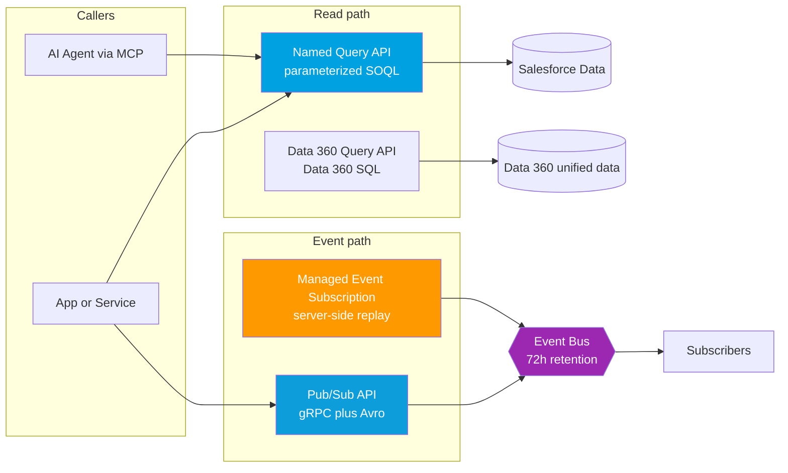

# 04 - Platform & API Additions (new integration capabilities)

> **One-liner**: Several APIs matured in 2026: **Named Query API** turns SOQL into a scalable REST resource, **Pub/Sub API** is the default event API with **Managed Event Subscriptions** for server-side replay, and **Data 360 APIs** unify ingestion and query.
> **Why it matters**: These are the building blocks you will reach for in new integrations, and the ones agents call as tools (see [02-agentforce-mcp-and-integration.md](02-agentforce-mcp-and-integration.md)).
> **Status**: API **v67.0** (Summer '26). Named Query API is **GA** (after Winter '26 Beta). Managed Event Subscriptions is **Beta**. Data 360 APIs are GA. Flags below. **Note**: Platform Event / CDC retention is **72 hours**, the "96 hours" you may see elsewhere is wrong.

This is Module 13, awareness depth. For deeper coverage see [Data Cloud APIs](../08-Modern-APIs/03-data-cloud-apis.md), [Event-Driven](../06-Event-Driven/02-platform-events.md), and the [modern API landscape](../08-Modern-APIs/04-modern-api-landscape.md).

---

## 1. The idea in plain English

Three retrieval-and-events building blocks got better, and the reason is the same as everywhere in 2026: things must be **callable by apps and by agents**, securely and at scale.

- Need to **read data**? A new **Named Query API** lets you define a SOQL query once and expose it as a fast REST resource, no Apex, no Flow.
- Need **events**? The **Pub/Sub API** is now the default subscriber API, and it can track your replay position for you.
- Need **unified customer data**? **Data 360** (formerly Data Cloud) has a full API surface for ingestion, query, profiles, and insights.

---

## 2. What's new (the specifics)

| Capability | What it is | Status (June 2026) |
|---|---|---|
| **Named Query API** | Define a SOQL query, expose it as a **REST resource** and an **agent action**, no code | **GA** (Beta in Winter '26) |
| **Pub/Sub API** | gRPC event API for publish and subscribe, the **default** event API | **GA** |
| **Managed Event Subscriptions** | Server-side replay tracking, Salesforce keeps your Replay ID | **Beta** |
| **Streaming API (CometD)** | Legacy event subscriber API | Legacy, avoid for new builds |
| **Data 360 APIs** | Ingestion, Query, Profile, Calculated Insights, Connect | GA |
| **Platform Events capacity** | Higher daily delivery on top tiers, **72-hour** retention | GA |
| **GraphQL chained mutations** | Reference an earlier operation's fields in one request | **GA** (v67.0) |
| **LWC State Managers / API v67.0** | State lives outside components, `lightning/accApi` drives Agentforce panel | **GA** (v67.0) |

### Named Query API

You provide a **label**, an **API version**, and a **SOQL query**, and bind parameters from the query string, for example `WHERE Name = :name` and `LIMIT :maxrecords`. Salesforce validates it and surfaces it as a **reusable REST resource**. It is **faster than Flow or Apex for retrieval** because it is a thin, optimized query path, no automation overhead. The same definition can be **viewed in the API Catalog**, invoked as a REST API, downloaded as an **OpenAPI** document, and turned into an **agent action**. This is the cleanest way to give apps and agents safe, parameterized read access without writing code.

### Pub/Sub API and Managed Event Subscriptions

**Pub/Sub API** is the modern gRPC API for both publishing and subscribing to **Platform Events** and **Change Data Capture**, with efficient binary **Avro** payloads. It is now the **default**, **Streaming API (CometD) is legacy**, keep it only for existing subscribers.

Historically a subscriber had to **store its own Replay ID** to resume after a disconnect. **Managed Event Subscriptions (Beta)** flips that: you define a `ManagedEventSubscription` (via Tooling or Metadata API) with a topic and a `defaultReplay` position, and **Salesforce maintains the replay store** on the server side. Your client can be **truly stateless**, no replay bookkeeping.

### Data 360 APIs

**Data 360** (rebranded from **Data Cloud** in Oct 2025) unifies customer data and exposes it through a full API surface:

- **Ingestion API** - stream or batch data **into** Data 360.
- **Query API** - run **Data 360 SQL** against unified data (the new `SET OPTIONS` clause sets the dataspace and `NULL`-handling for data lake objects).
- **Profile API** - read unified customer profiles.
- **Calculated Insights API** - query precomputed metrics (dimensions and measures).
- **Connect API** - high-performance ingest plus query and insight management.

Deeper treatment lives in [../08-Modern-APIs/03-data-cloud-apis.md](../08-Modern-APIs/03-data-cloud-apis.md).

### Platform Events capacity, and the 72-hour fact

Top tiers get **higher daily event delivery** allocations in 2026 for high-volume event-driven apps. The number to **memorize correctly**:

> **Platform Events and Change Data Capture are retained for 72 hours.** This is the window in which Pub/Sub API can replay events. You will see "96 hours / 4 days" in some blog posts (and this vault's old README) - that is **incorrect**. The official Pub/Sub API "Event Message Durability" doc states **72 hours**.

---

## 3. How it works (retrieval and events)

**Read path**: callers (apps or agents) hit a **Named Query** for parameterized SOQL, or the **Data 360 Query API** for unified data. **Event path**: publishers and subscribers use **Pub/Sub API**, the **event bus retains messages 72 hours**, and a **Managed Event Subscription** lets Salesforce track the replay position so the subscriber stays stateless.

---

## 4. What it means for integration work

| Need | Reach for | Why |
|---|---|---|
| Parameterized read for an app or agent | **Named Query API** | No code, faster than Flow/Apex, OpenAPI + agent action for free |
| Subscribe to events (new build) | **Pub/Sub API** | The default, efficient gRPC + Avro, Streaming API is legacy |
| Resume events without client state | **Managed Event Subscriptions** (Beta) | Salesforce keeps your Replay ID |
| Unified customer data in or out | **Data 360 APIs** | One surface for ingest, query, profile, insights |

**Quick dev-improvement notes relevant to integration** (all v67.0, GA unless flagged): **GraphQL chained mutations** create linked records in one round trip, cutting callouts. **Apex now defaults to user mode** and `with sharing`, so callout-and-DML logic enforces the running user's permissions by default, exactly the posture agent-called actions need. **LWC State Managers** move state out of components, and the new `lightning/accApi` module lets an LWC open and drive the **Agentforce** side panel.

**Net**: new integrations should default to **Named Query for reads**, **Pub/Sub for events**, and **Data 360 APIs for unified data**, all of which double as **agent tools** via hosted MCP servers.

---

## 5. Interview Q&A

**Q: What is the Named Query API and when would you use it over Flow or Apex?**
A: It exposes a **predefined, parameterized SOQL query as a REST resource** with no code. Use it for **retrieval** when you would otherwise write a Flow or Apex just to return records, it is faster, comes with an OpenAPI doc, appears in the API Catalog, and can be an **agent action**.

**Q: Pub/Sub API or Streaming API for a new subscriber?**
A: **Pub/Sub API**. It is the **default** modern gRPC API with efficient Avro payloads for Platform Events and CDC. **Streaming API (CometD) is legacy**, only keep it for existing integrations.

**Q: What problem do Managed Event Subscriptions solve?**
A: Clients no longer have to **store their own Replay ID**. With a `ManagedEventSubscription`, **Salesforce maintains the replay store** server-side, so the subscriber can be stateless and resume cleanly. It is **Beta**.

**Q: How long are Platform Events retained?**
A: **72 hours.** That is the Pub/Sub API replay window. (Some sources say 96, that is wrong.)

**Q: What are the main Data 360 APIs?**
A: **Ingestion** (data in), **Query** (Data 360 SQL out), **Profile** (unified profiles), **Calculated Insights** (precomputed metrics), and the high-performance **Connect API**. Data 360 is the Oct 2025 rebrand of Data Cloud.

**Talking point to explain it to anyone**: "We made the common jobs one-liners. Reading data is a saved query you call by name, listening for changes is a single modern pipe that remembers where you left off, and all of it doubles as a tool an AI agent can use."

---

## 6. Key terms

**Named Query API** (SOQL as a REST resource and action), **Pub/Sub API** (default gRPC event API), **Managed Event Subscription** (server-side replay tracking), **Replay ID** (event position marker), **Avro** (binary payload format), **Data 360** (unified data platform, ex-Data Cloud), **72-hour retention** (event replay window). Events are covered in [Module 06](../06-Event-Driven/02-platform-events.md), Data 360 APIs in [Module 08](../08-Modern-APIs/03-data-cloud-apis.md).

---

## Sources (Verified June 2026)

- [Named Query APIs for SOQL Queries - REST API Developer Guide](https://developer.salesforce.com/docs/atlas.en-us.api_rest.meta/api_rest/resources_named_query_intro.htm)
- [Named Query API Simplifies Data Access for Agents and Apps - Salesforce Developers Blog](https://developer.salesforce.com/blogs/2025/06/named-query-api-simplifies-data-access-for-agents-and-apps)
- [Event Message Durability (72-hour retention) - Pub/Sub API Guide](https://developer.salesforce.com/docs/platform/pub-sub-api/guide/event-message-durability.html)
- [Managed Event Subscriptions (Beta) - Pub/Sub API Guide](https://developer.salesforce.com/docs/platform/pub-sub-api/guide/managed-sub.html)
- [The Salesforce Developer's Guide to the Summer '26 Release](https://developer.salesforce.com/blogs/2026/06/the-salesforce-developers-guide-to-the-summer-26-release)

---

*Next: back to the [README.md](README.md) for the full Module 13 map.*
