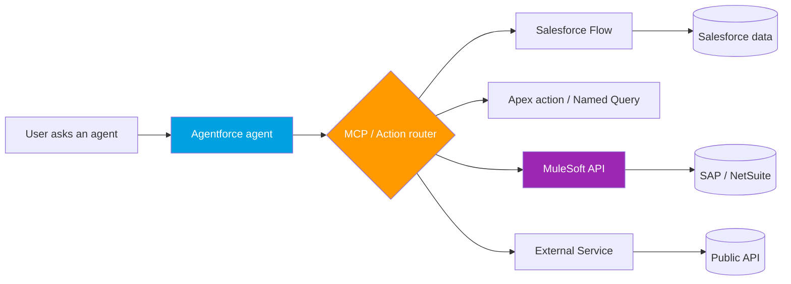

# Module 13 - What's New in 2026

> **Goal**: Know what's arriving and what's going away so you sound current and never get blindsided.
> **API version**: v66.0 (Spring '26); current live is v67.0 (Summer '26). Learn Modules 01-12 first, then use this for awareness.

Two forces define 2026: the **AI-agent shift** (Agentforce + MCP turning integrations into agent-callable Actions) and a wave of **security-driven retirements** (OAuth + External Client Apps everywhere). This module is awareness-depth, but accurate and sourced.

---

## Map of this module

| # | File | What it covers |
|---|---|---|
| 01 | [retirements-and-deprecations](01-retirements-and-deprecations.md) | The 2026-2028 retirement timeline + migrations |
| 02 | [agentforce-mcp-and-integration](02-agentforce-mcp-and-integration.md) | AI agents calling integrations as Actions via MCP |
| 03 | [mulesoft-2026](03-mulesoft-2026.md) | Agent Fabric, Composer, API Catalog, governance |
| 04 | [platform-and-api-additions](04-platform-and-api-additions.md) | Named Query API, Pub/Sub default, Data Cloud APIs |

---

## Headline changes (the quick table)

| Theme | What | When / status |
|---|---|---|
| **Retiring** | SOAP `login()` | Summer '27 (Jun 1, 2027) |
| **Retiring** | OAuth Username-Password flow | Winter '27 |
| **Off by default** | New Connected App creation | Spring '26 |
| **Discontinued** | Salesforce-to-Salesforce | Summer '26 |
| **New (GA)** | Salesforce-hosted **MCP servers** | Summer '26 |
| **New (GA)** | **Named Query API** | 2026 |
| **Default** | **Pub/Sub API** for events (Streaming legacy) | now |
| **Beta** | Managed Event Subscriptions | 2026 |

Full dated timeline in [01-retirements-and-deprecations.md](01-retirements-and-deprecations.md).

---

## How AI agents change integration

**The key shift**: integrations are now exposed as **Actions** that AI agents discover and call. Your Apex action, Flow, Named Query, or MuleSoft API can become an agent tool, accessed over standard **OAuth**. Detail in [02-agentforce-mcp-and-integration.md](02-agentforce-mcp-and-integration.md).

---

## Accuracy note

The event-bus retention for high-volume Platform Events and Change Data Capture is **72 hours (3 days)**, not 96. If you see "96-hour replay" anywhere, it's wrong. See [Module 06](../06-Event-Driven/01-event-driven-basics.md).

---

## Outcome

You won't be blindsided when someone says "wire this into Agentforce," "expose this as an MCP action," or "we need to migrate off SOAP login before Summer '27."

---

## Sources (Verified June 2026)

- [Spring '26 Release Architect Highlights — Salesforce](https://www.salesforce.com/blog/spring-26-release-architect-highlights/)
- [The Salesforce Developer's Guide to the Summer '26 Release](https://developer.salesforce.com/blogs/2026/06/the-salesforce-developers-guide-to-the-summer-26-release)
- [Platform SOAP API login() Retirement — Salesforce Help](https://help.salesforce.com/s/articleView?id=005132110&type=1)
- [Event Message Durability — Pub/Sub API](https://developer.salesforce.com/docs/platform/pub-sub-api/guide/event-message-durability.html)

*Each file has its own Sources section with specific official docs.*
